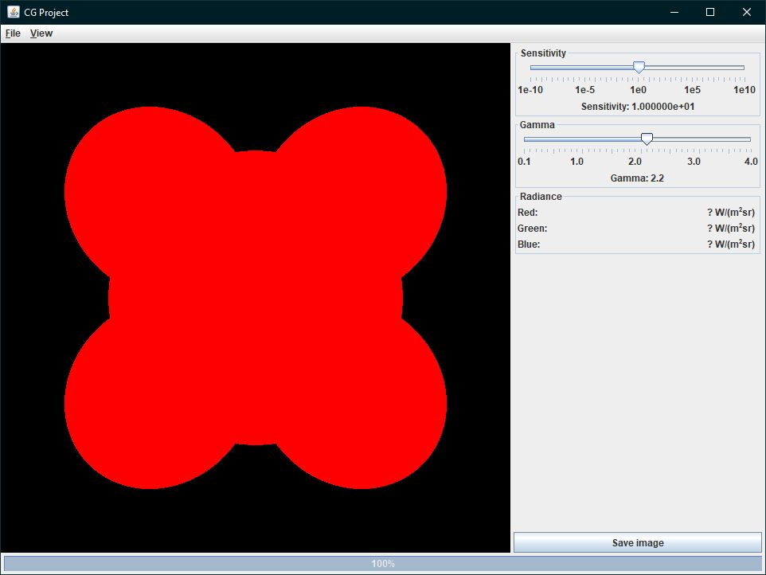

# [CGPracticum](http://graphics.cs.kuleuven.be/courses/H07Z5a/opgave.html)

Course [Computer Graphics: Project (B-KUL-H07Z5A)](https://onderwijsaanbod.kuleuven.be/syllabi/n/H07Z5AN.htm#activetab=doelstellingen_idp1405792)

**Academic Years**: 2014-2018 (2nd semester - 1st/2nd Master of Science in Engineering: Computer Science)

## About

The *optional* starting code base of a ray tracing engine for the course [Computer Graphics: Project (B-KUL-H07Z5A)](https://onderwijsaanbod.kuleuven.be/syllabi/n/H07Z5AN.htm#activetab=doelstellingen_idp1405792).

